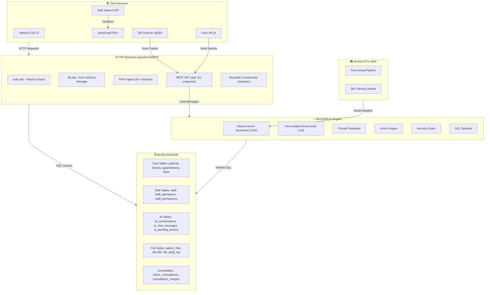
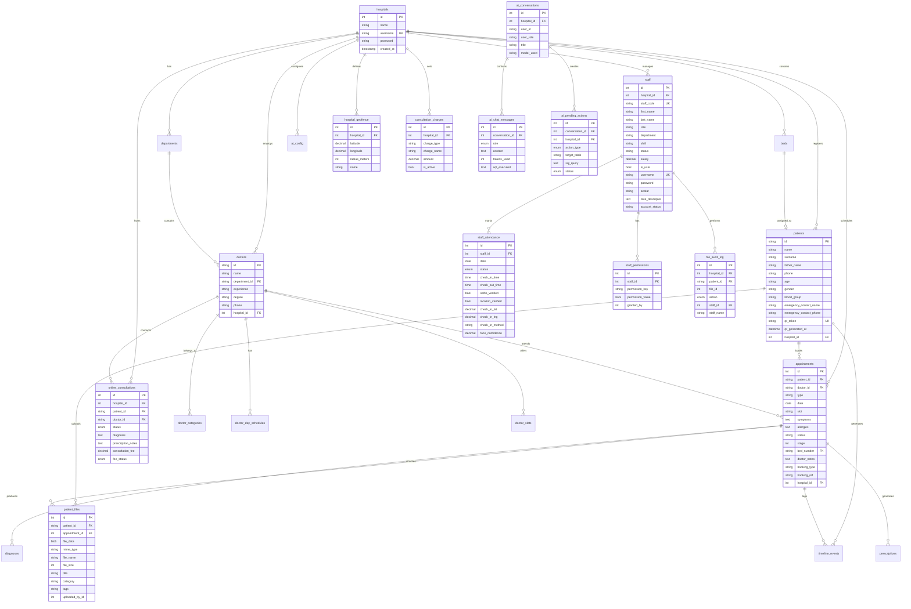
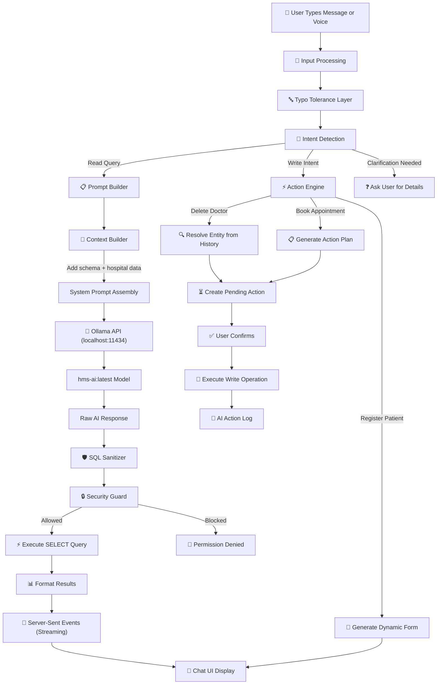
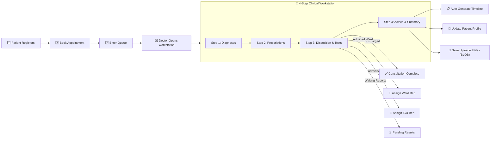
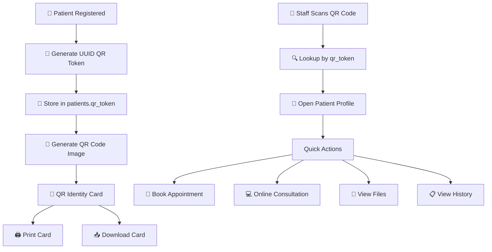
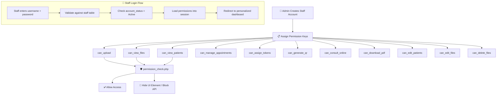

<p align="center">
  
</p>

<h1 align="center">🏥 Hospital Management System</h1>

<p align="center">
  <strong>A modern, AI-powered, full-featured web-based Hospital Management System built with PHP, MySQL, Tailwind CSS, and a locally fine-tuned LLM (BHOOMA AI)</strong>
</p>

<p align="center">
  
  
  
  
  
  
  
  
</p>

---

## 📋 Table of Contents

- [Project Overview](#-project-overview)
- [What Makes This Project Unique](#-what-makes-this-project-unique)
- [System Architecture Diagram](#-system-architecture-diagram)
- [Complete Feature List (25+ Modules)](#-complete-feature-list-25-modules)
- [Database Schema (25+ Tables) — ER Diagram](#-database-schema-25-tables--er-diagram)
- [AI Chatbot Architecture (BHOOMA AI)](#-ai-chatbot-architecture-bhooma-ai)
- [Consultation Workflow Diagram](#-consultation-workflow-diagram)
- [Patient QR Code Lifecycle](#-patient-qr-code-lifecycle)
- [Staff Permission System](#-staff-permission-system)
- [Project File Tree](#-project-file-tree)
- [API Reference (21 Endpoints)](#-api-reference-21-endpoints)
- [How Key Systems Work](#-how-key-systems-work)
- [Screenshots & UI Preview](#-screenshots--ui-preview)
- [Installation & Setup](#%EF%B8%8F-installation--setup)
- [Security Features](#-security-features)
- [Technologies Used](#-technologies-used)
- [Future Enhancements](#-future-enhancements)
- [Contributing](#-contributing)
- [License](#-license)
- [Author](#-author)

---

## 🌟 PROJECT OVERVIEW

This is a **comprehensive, production-ready Hospital Management System** designed to digitize every aspect of hospital operations. From patient registration to AI-powered natural language queries, from selfie-based staff attendance to real-time QR code patient identification — this system covers it all.

### Key Highlights
- 🤖 **AI-Powered Chatbot** — A locally fine-tuned LLM (BHOOMA AI) that understands natural language queries about patients, doctors, beds, and more
- 📸 **Selfie Attendance** — Staff can mark attendance using facial recognition with geofencing
- 📱 **QR Code Patient Cards** — Each patient gets a unique lifetime QR code for instant identification
- 💻 **Online Consultation** — Remote patient consultation with diagnosis, prescription, and file uploads
- 🔒 **Granular Permissions** — Role-based access control with 11+ configurable permission keys per staff member
- 💾 **Binary BLOB Storage** — Medical files stored safely inside the database, not on the filesystem
- 🧠 **GPU-Accelerated AI Training** — Fine-tune the hospital AI model on an NVIDIA RTX 4060 GPU with a 3M dataset
- 🏨 **Multi-Hospital Support** — Each hospital gets its own isolated data with unique codes

---

## 🎯 WHAT MAKES THIS PROJECT UNIQUE

| Feature | Most HMS Projects | This Project |
|---------|------------------|--------------|
| AI Chatbot | ❌ None | ✅ Fine-tuned LLM with natural language SQL, voice dictation, action engine |
| Staff Attendance | ❌ Basic checkbox | ✅ Selfie verification + GPS geofencing + face recognition |
| Patient ID | ❌ Manual search | ✅ Lifetime QR code with instant scan-to-profile |
| Online Consultation | ❌ Not included | ✅ Full remote consultation with diagnosis, prescription, files |
| File Storage | ❌ Filesystem (unsafe) | ✅ Binary BLOB in MySQL (immune to filesystem corruption) |
| Permissions | ❌ Basic roles | ✅ 11+ granular permission keys per staff member |
| Staff Portal | ❌ Admin only | ✅ Staff login with personalized dashboard & permission-gated views |
| AI Training | ❌ Cloud dependency | ✅ Local GPU fine-tuning dashboard with live loss curves |
| Backup/Restore | ❌ phpMyAdmin | ✅ Built-in with schema validation scanner & animated progress |

---

## 🏗️ SYSTEM ARCHITECTURE DIAGRAM



---

## 🚀 COMPLETE FEATURE LIST (25+ Modules)

### 1. 🔐 Authentication & Multi-Hospital Support
- Session/cookie-based login with hospital code verification
- Multi-hospital isolation — each hospital gets a unique code and separate data
- Hospital self-registration with auto-generated codes
- **Staff login portal** — staff members can log in with their own credentials
- Protected routes — all pages require authentication via `auth.php`
- Logout confirmation modal with animated graphic

### 2. 📊 Dashboard (`dashboard.php`)
- Real-time KPI stats: total patients, live queue count, today's appointments, occupied beds, active staff, total doctors
- Live heartbeat canvas animation in header
- **Emergency notification banner** — auto-displays when emergency patients are in the queue with critical alert cards
- Quick action buttons to navigate to all key modules
- Staff summary section showing today's attendance overview
- **Staff-specific dashboard view** — staff see a personalized view based on their permissions

### 3. 👤 Patient Management
- **Patient Registration** (`index.php`) with floating label inputs, custom dropdowns for Gender & Blood Group
- **Patient Directory** (`patients.php`) with searchable grid/table view, instant multi-term search
- 10-digit phone validation, clickable `tel:` links
- Full CRUD operations with confirmation modals
- **QR token generation** — every patient gets a unique lifetime QR code
- **Emergency contact** tracking (name + phone)

### 4. 📝 Patient Profile (`patient_profile.php`)
- **Full 4-step consultation workstation display** matching the clinical workflow:
  - Step 1: Diagnoses (ICD-style diagnosis list)
  - Step 2: Prescriptions with patient-friendly frequency translations (`TID→"3 Times Daily"`, `SOS→"As Needed"`, `BID→"Twice Daily"`, `QID→"4 Times Daily"`, `OD→"Once Daily"`)
  - Step 3: Disposition info with state banners (Discharged, Waiting for Reports, Admitted Ward/ICU with bed numbers)
  - Step 4: Doctor's advice and clinical notes
- Ordered diagnostic tests display
- Quick stats bar (total visits, medicines prescribed, files uploaded)
- **Printable prescription slip** modal with `@media print` CSS
- Image preview lightbox modal
- First appointment auto-expanded, edit profile modal

### 5. 📱 Patient QR Code System (`patient_profile_qr.php`)
> **🆕 Newly Added**

- **Lifetime QR code** — each patient gets a permanent UUID-based QR token
- **QR Scanner** — scan any patient QR to instantly open their full profile
- **QR Card Modal** — generate a printable/downloadable patient QR identity card
- Works offline once generated — the QR token never changes
- QR-based patient lookup for fast walk-in registration

### 6. ⏱️ Queue Management & Clinical Consultation (`queue.php`)
- Live patient queue pipeline with status management
- **4-Step Consultation Workstation:**
  - Step 1 — Diagnoses: Add multiple diagnoses with descriptions
  - Step 2 — Prescriptions: Medicine name, dosage, frequency, duration, instructions
  - Step 3 — Disposition & Tests: Set disposition (Discharged/Admitted Ward/Admitted ICU/Waiting for Reports), order diagnostic tests, assign beds
  - Step 4 — Advice & Summary: Doctor's notes, clinical summary, finalize
- File uploads during consultation (stored as binary BLOB in database)
- Activity timeline auto-generated for each visit
- Patient dossier modal for quick-view from queue

### 7. 🗄️ Binary BLOB File Storage System
- All medical files (X-rays, lab reports, scans) stored as `LONGBLOB` in MySQL
- No dependency on filesystem — data safe even if files are accidentally deleted
- `patient_files` table stores: `file_data` (LONGBLOB), `mime_type`, `file_name`, `file_size`
- Files served via `api/file.php` with proper `Content-Type` headers
- Supports image preview (JPEG, PNG) and PDF files
- **File categories** — tag files with categories like X-Ray, Lab Report, Prescription
- **File audit log** — tracks who uploaded, viewed, edited, or deleted each file

### 8. 📂 Patient File Viewer (`patient_file_view.php`)
> **🆕 Newly Added**

- **Gallery view** of all patient medical files
- Image lightbox with zoom capability
- **Upload modal** for adding new medical files with metadata
- File categorization (X-Ray, Blood Report, ECG, etc.)
- Staff-permission-gated: Upload, View, Edit, Delete permissions separately configurable

### 9. 👨‍⚕️ Doctor Management (`doctors.php`)
- Doctor directory with department filtering
- Availability tracking (Available, Consulting, On Leave)
- Doctor categories and multi-department specializations
- Day-wise schedule management with break times
- Phone contact and experience/degree display

### 10. 📅 Appointment Booking System
- **Quick booking** from patient directory or profile (`book_appointment.php`)
- Department → Doctor → Time Slot selection flow
- Auto-generated appointment codes
- Prevents double-booking, checks doctor availability
- **Booking types** — Walk-in, Online, Referral
- **Token assignment** with timestamp and assigned-by tracking
- **Patient self-booking** (`patient_booking.php`)

### 11. 🏨 Bed & Ward Management (`beds.php`)
- Visual bed map organized by wards
- Color-coded bed status (Available, Occupied, Maintenance)
- Assign/release beds directly from interface
- Ward occupancy statistics
- Hospital-scoped bed isolation

### 12. 👥 Staff Management (`staff.php`)
- **3 View Modes:**
  - **Daily Roster:** Today's attendance with check-in status per staff member
  - **Staff Directory:** Full list with roles, departments, contact info
  - **Monthly Sheet:** Day-by-day attendance matrix for the entire month
- Add/Edit/Delete staff with full profile (name, role, department, phone, email, photo, shift, salary, qualification)
- Staff avatar photos
- Quick "Mark All Present" — one-click mark all active staff
- Individual attendance marking (Present, Absent, Late, Half-Day, On Leave)
- Monthly analytics with attendance percentage per staff member
- Staff user account creation (optional)

### 13. 📸 Selfie Attendance System (`selfie_attendance.php`)
> **🆕 Newly Added**

- **Face recognition** — staff take a selfie to verify identity before marking attendance
- **Geofencing** — validates GPS location to ensure staff are physically at the hospital
- Uses `face-api.js` for browser-based face detection and matching
- Stores face descriptors in the `staff` table for comparison
- Records `check_in_lat`, `check_in_lng`, `face_confidence`, `selfie_verified` in attendance
- **Face registration modal** — staff register their face descriptor on first use
- Hospital geofence configuration via `hospital_geofence` table

### 14. 🔑 Staff Permissions & Access Control (`staff_permissions.php`)
> **🆕 Newly Added**

- **11+ Granular Permission Keys:**
  - `can_upload` — Upload patient files
  - `can_view_files` — View patient medical files
  - `can_view_patients` — Access patient directory
  - `can_manage_appointments` — Create/edit appointments
  - `can_assign_tokens` — Assign queue tokens
  - `can_generate_qr` — Generate patient QR codes
  - `can_consult_online` — Conduct online consultations
  - `can_download_pdf` — Download medical record PDFs
  - `can_edit_patients` — Edit patient details
  - `can_edit_files` — Edit file metadata
  - `can_delete_files` — Delete patient files
- **Admin-only management page** — view all staff accounts, toggle permissions, block/activate accounts
- KPI stats: total accounts, active accounts, portal users, blocked accounts
- View staff login credentials (staff code, username, password)
- Searchable, filterable staff permissions table

### 15. 💻 Online Consultation (`online_consult.php`)
> **🆕 Newly Added**

- **Remote patient consultation** — doctors can consult patients online
- Diagnosis entry, prescription notes, doctor's private notes
- Upload prescription images during consultation
- View patient's previous files gallery
- View previous consultation history
- Consultation fee tracking with configurable charges
- Session lifecycle: Initiated → In Progress → Completed / Cancelled

### 16. 💰 Consultation Charges (`charges.php`)
> **🆕 Newly Added**

- **Manage all consultation and service charges**
- Default seed charges: Online Consultation (₹500), Follow-up (₹300), General OPD (₹200), Specialist (₹800), PDF Download (₹0)
- Add/Edit/Delete charges with charge type keys
- Toggle charge active/inactive status
- Hospital-scoped charge configuration

### 17. 🤖 BHOOMA AI Clinical Assistant (Chatbot)
> **Major Feature — Locally Fine-Tuned LLM**

- **Natural language queries** — ask "How many patients are admitted?" or "Show today's appointments"
- **Dynamic SQL execution** — AI generates verified SQL queries against your database
- **Action engine** — AI can INSERT, UPDATE, DELETE records with user confirmation
- **Multi-turn conversations** — remembers context across messages
- **Typo tolerance** — understands misspelled queries
- **Voice dictation** — speak your queries using Web Speech API
- **Sound effects** — synthesized chimes for send/receive using Web Audio API
- **Conversation history** — slide-out drawer with searchable past conversations
- **Export conversations** — download chat as `.md` markdown file
- **Workstation mode** — expand chatbot to full-screen for extended use
- **Live suggestions** — as-you-type suggestion popup with categorized commands
- **Quick suggestions bar** — page-context-aware pre-built queries
- **Action cards** — confirm/cancel pending database mutations
- **In-chat forms** — dynamically generated forms for patient registration, doctor creation, etc.
- **Keyboard shortcut** — `Ctrl+K` to toggle chatbot
- **Mobile responsive** — full-screen on mobile devices

### 18. 🧠 AI Model Training Dashboard (`ai_training_dashboard.php`)
- **Real-time GPU telemetry** — monitor NVIDIA RTX 4060 VRAM, temperature, utilization
- **Training progress** — live step counter, epoch progress, loss curve chart
- **Dataset generation** — one-click re-generate training dataset from live database
- **Launch training** — start 22-epoch fine-tuning run directly from the dashboard
- **Ollama status** — check if the AI model is loaded and active
- **Training logs** — view real-time training output
- Uses Chart.js for high-precision loss curve rendering

### 19. 📋 AI Logs (`ai_logs.php`)
- View all AI action logs — who executed what, when, and the result
- Track confirmed/cancelled/expired actions
- Security audit trail for all AI-generated database operations

### 20. 💾 Database Backup System (`backup.php`)
- **Create Backup:** Full SQL dump of all 25+ tables including BLOB hex encoding
- **List Backups:** View all saved `.sql` files with size and creation date
- **Download Backup:** Download any backup directly to PC
- **Delete Backup:** Remove old backups with confirmation
- **Open Backup Folder:** Opens Windows File Explorer to the backup directory
- Animated success checkmark SVG after creation
- Wrapped in `START TRANSACTION / COMMIT` for atomicity

### 21. 🔄 Data Restore System (`restore.php`)
- **Upload SQL File** — upload a `.sql` backup from PC
- **Schema Compatibility Scanner:**
  - Scans uploaded SQL for `CREATE TABLE` statements
  - Compares against current database schema
  - Validates table names AND column fields match
  - Shows animated scanning progress table by table
  - Green ✅ for compatible tables, red ❌ for mismatches
  - Detailed field comparison on mismatch
- **Restore Execution:** Execute restore if all tables pass validation
- **Success Animation:** Animated checkmark on successful restore

### 22. 📂 Medical Records & History (`history.php`)
- Global searchable table of all patient visits
- Date, patient name, doctor, consultation type, status, diagnoses
- Click-to-profile navigation
- Activity timeline per visit

### 23. 📖 Guide (`guide.php`)
- Interactive walkthrough of system features for new users

### 24. 🎨 UI/UX Design Features
- Modern **glass-morphism** design with `backdrop-blur`, rounded corners, shadows
- **Apple-style cards** with hover effects
- Fully responsive (desktop, tablet, mobile)
- **Desktop sidebar** + **mobile hamburger drawer**
- Custom styled dropdowns for Gender and Blood Group
- **Floating label animated inputs**
- Toast notifications (success/error)
- Skeleton loaders during data fetch
- Confirmation modals for destructive actions
- Gradient backgrounds and card-based layouts
- **Consistent black icon theme** across sidebar navigation

### 25. 📄 PDF Generation (`js/pdf-generator.js`)
> **🆕 Newly Added**

- Generate downloadable PDF medical records for patients
- Uses `html2canvas` for rendering and PDF generation
- Permission-gated — only staff with `can_download_pdf` can download

---

## 🗄️ DATABASE SCHEMA (25+ Tables) — ER Diagram



### Full Table Summary

| # | Table | Purpose |
|---|-------|---------|
| 1 | `hospitals` | Hospital registration — name, credentials, code |
| 2 | `patients` | Patient records — demographics, QR token, emergency contacts |
| 3 | `doctors` | Doctor profiles — specialization, experience, degree |
| 4 | `departments` | Hospital departments with icons |
| 5 | `doctor_categories` | Many-to-many doctor-department mapping |
| 6 | `doctor_day_schedules` | Per-day availability, timing, break slots |
| 7 | `doctor_slots` | Available time slots per doctor |
| 8 | `appointments` | Bookings — date, slot, type, status, stage, booking_type |
| 9 | `diagnoses` | Diagnoses per appointment |
| 10 | `prescriptions` | Medicine prescriptions with dosage and instructions |
| 11 | `timeline_events` | Auto-generated activity timeline per visit |
| 12 | `patient_files` | Medical files as BLOB — X-rays, reports, scans |
| 13 | `beds` | Bed/ward inventory — number, type, status |
| 14 | `staff` | Staff registry — full profile, credentials, face descriptor |
| 15 | `staff_attendance` | Daily attendance with selfie/geofence verification |
| 16 | `staff_permissions` | Granular permission keys per staff member |
| 17 | `system_state` | System configuration/state flags |
| 18 | `ai_config` | AI model configuration per hospital |
| 19 | `ai_conversations` | Chatbot conversation sessions |
| 20 | `ai_chat_messages` | Individual chat messages with SQL executed |
| 21 | `ai_pending_actions` | Pending write operations awaiting user confirmation |
| 22 | `ai_action_log` | Audit log for all AI-executed database operations |
| 23 | `online_consultations` | Remote consultation sessions with fee tracking |
| 24 | `consultation_charges` | Configurable service charges |
| 25 | `hospital_geofence` | GPS geofence boundaries for attendance |
| 26 | `file_audit_log` | File upload/view/edit/delete audit trail |

---

## 🤖 AI CHATBOT ARCHITECTURE (BHOOMA AI)



### AI System Components

| Component | File | Purpose |
|-----------|------|---------|
| **Config** | `ai/config.php` | Ollama URL, model name, temperature, rate limits |
| **Ollama Client** | `ai/ollama_client.php` | HTTP client for Ollama API with SSE streaming |
| **Prompt Templates** | `ai/prompt_templates.php` | System prompts, golden rules, page-context suggestions |
| **Context Builder** | `ai/context_builder.php` | Builds hospital context: schema, stats, current data |
| **Schema Provider** | `ai/schema_provider.php` | Introspects live database schema for AI prompts |
| **Action Engine** | `ai/action_engine.php` | Multi-turn entity resolution, form generation, write operations |
| **Security Guard** | `ai/security_guard.php` | Role-based table access control (Admin, Receptionist, Nurse, Doctor) |
| **SQL Sanitizer** | `ai/sql_sanitizer.php` | Validates and sanitizes AI-generated SQL queries |
| **System Knowledge** | `ai/system_knowledge.php` | Static hospital domain knowledge for the AI |
| **Chatbot API** | `api/chatbot.php` | Main chat endpoint with SSE streaming |
| **Chat Widget** | `includes/chatbot_widget.php` | Full chatbot UI — 3000+ lines of HTML/CSS/JS |

### AI Training Pipeline

| Component | File | Purpose |
|-----------|------|---------|
| **Dataset Generator** | `ai/python/dataset_generator.py` | Generates 10,000+ training examples from live DB |
| **Fine-Tune Script** | `ai/python/fine_tune_hms.py` | Hugging Face fine-tuning with LoRA adapters |
| **Local GPU Trainer** | `ai/python/train_local_gpu.bat` | One-click RTX 4060 training launcher |
| **Quick Trainer** | `ai/python/train_hms_quick.py` | Rapid iteration training script |
| **Modelfile** | `ai/python/Modelfile` | Ollama Modelfile for deploying the fine-tuned model |
| **Auto-Train** | `ai/python/auto_train.ps1` | PowerShell automation for end-to-end training |

---

## ⚕️ CONSULTATION WORKFLOW DIAGRAM



---

## 📱 PATIENT QR CODE LIFECYCLE



---

## 🔑 STAFF PERMISSION SYSTEM



---

## 📁 PROJECT FILE TREE

```text
Hospital Management System/
├── ai/                              # 🤖 AI Engine (BHOOMA AI)
│   ├── config.php                   # AI configuration (Ollama URL, model, temperature)
│   ├── ollama_client.php            # HTTP client for Ollama with SSE streaming
│   ├── prompt_templates.php         # System prompts, golden rules, suggestions
│   ├── context_builder.php          # Hospital context assembler for AI
│   ├── schema_provider.php          # Live database schema introspector
│   ├── action_engine.php            # Multi-turn action resolution engine
│   ├── security_guard.php           # Role-based access control for AI queries
│   ├── sql_sanitizer.php            # AI-generated SQL validation & sanitization
│   ├── system_knowledge.php         # Static hospital domain knowledge
│   └── python/                      # 🧠 GPU Training Pipeline
│       ├── dataset_generator.py     # Generate training dataset from live DB
│       ├── fine_tune_hms.py         # Hugging Face LoRA fine-tuning script
│       ├── fine_tune_local.py       # Alternative local fine-tuning
│       ├── train_hms_quick.py       # Quick iteration training
│       ├── train_local_gpu.bat      # One-click RTX 4060 launcher
│       ├── auto_train.ps1           # PowerShell training automation
│       ├── Modelfile                # Ollama Modelfile for deployment
│       ├── hms_master_schema.json   # Master schema reference
│       ├── hms_training_alpaca.json # Alpaca-format training data
│       ├── hms_training_chatml.jsonl# ChatML-format training data
│       └── README.md                # AI training documentation
│
├── api/                             # 🔌 REST API Endpoints (21 files)
│   ├── auth.php                     # Authentication (login, register, verify, logout)
│   ├── patients.php                 # Patient CRUD operations
│   ├── doctors.php                  # Doctor management
│   ├── booking.php                  # Appointment booking & slots
│   ├── consultation.php             # Clinical consultation data & BLOB uploads
│   ├── beds.php                     # Bed/ward management
│   ├── history.php                  # Patient history & dossier
│   ├── queue.php                    # Queue management
│   ├── staff.php                    # Staff CRUD & attendance
│   ├── backup.php                   # Backup create/list/delete/download/restore/scan
│   ├── file.php                     # Binary BLOB file serving
│   ├── files.php                    # File management & metadata
│   ├── pdf.php                      # PDF data retrieval for patient files
│   ├── chatbot.php                  # AI chatbot endpoint with SSE
│   ├── dashboard.php                # Dashboard stats API
│   ├── permissions.php              # Staff permissions CRUD
│   ├── qr.php                       # QR code generation & lookup
│   ├── attendance_selfie.php        # Selfie attendance verification
│   ├── online_consultation.php      # Online consultation CRUD
│   ├── charges.php                  # Consultation charges management
│   └── ai_train_api.php             # AI training control API
│
├── includes/                        # 🧩 Reusable PHP Components
│   ├── header.php                   # Global sidebar + mobile drawer navigation
│   ├── footer.php                   # Global page footer + chatbot widget include
│   ├── booking_modal.php            # Appointment booking modal
│   ├── confirm_modal.php            # Confirmation dialog component
│   ├── dossier_modal.php            # Patient dossier popup modal
│   ├── logout_modal.php             # Logout confirmation modal
│   ├── book_popup.php               # Quick booking popup
│   ├── chatbot_widget.php           # 🤖 Full AI chatbot UI (3000+ lines)
│   ├── permission_check.php         # Permission verification helper
│   ├── permissions_modal.php        # Staff permissions modal
│   ├── patient_qr_card_modal.php    # QR identity card generator modal
│   ├── qr_scanner_modal.php         # QR code scanner modal (uses camera)
│   ├── face_register_modal.php      # Face registration for selfie attendance
│   ├── file_viewer_modal.php        # File preview/viewer modal
│   ├── upload_modal.php             # File upload modal with categorization
│   ├── reception_hub.php            # Reception desk quick-action hub
│   └── staff_dashboard_view.php     # Staff-specific dashboard content
│
├── js/                              # 📜 JavaScript Modules
│   ├── file-upload.js               # File upload handler
│   ├── file-viewer.js               # File viewing/preview logic
│   ├── pdf-generator.js             # PDF generation for medical records
│   ├── permissions.js               # Permission management UI logic
│   ├── qr-scanner.js                # QR code scanning with camera
│   ├── selfie-attendance.js         # Face recognition & geofencing logic
│   └── html2canvas.min.js           # HTML to canvas rendering library
│
├── images/                          # 🖼️ Static image assets
├── uploads/                         # 📤 Upload directories (gitignored)
│   ├── patients/                    # Patient file uploads
│   └── staff_avatars/               # Staff profile photos
├── backups/                         # 💾 SQL backup files (gitignored)
├── Database/                        # 📦 Database reference files
│
├── index.php                        # Patient Registration Page
├── login.php                        # Login Page (Admin + Staff)
├── register_hospital.php            # Hospital Registration
├── dashboard.php                    # Main Dashboard with live stats
├── patients.php                     # Patient Directory
├── patient_profile.php              # Full Patient Profile
├── patient_profile_qr.php           # 🆕 QR-based Patient Profile
├── patient_file_view.php            # 🆕 Patient File Gallery Viewer
├── patient_booking.php              # 🆕 Patient Self-Booking
├── patient_book.php                 # Patient booking page
├── doctors.php                      # Doctor Management
├── doctor_slots.php                 # Doctor Time Slot Management
├── book.php                         # Appointment Booking
├── book_appointment.php             # 🆕 Enhanced Appointment Booking
├── beds.php                         # Bed & Ward Management
├── queue.php                        # Live Queue & 4-Step Consultation
├── history.php                      # Global Patient History Log
├── staff.php                        # Staff Management & Attendance
├── staff_permissions.php            # 🆕 Staff Accounts & Permissions
├── selfie_attendance.php            # 🆕 Selfie Attendance System
├── online_consult.php               # 🆕 Online Consultation
├── charges.php                      # 🆕 Consultation Charges
├── backup.php                       # Database Backup Management
├── restore.php                      # Data Restore with Schema Validation
├── ai_training_dashboard.php        # AI Training & GPU Monitor
├── ai_logs.php                      # AI Action Logs
├── guide.php                        # System Guide
├── about.php                        # About Page
├── auth.php                         # Authentication Guard
├── db.php                           # Database Connection & Auto-Schema
├── setup.php                        # Initial Database Setup
├── schema.sql                       # Base SQL Schema Reference
├── .htaccess                        # Apache configuration
├── .gitignore                       # Git ignore rules
└── README.md                        # 📖 This file
```

---

## 🔌 API REFERENCE (21 Endpoints)

### Authentication API (`api/auth.php`)
| Action | Method | Parameters | Description |
|--------|--------|-----------|-------------|
| `login` | POST | username, password, hospital_code | Authenticate admin or staff |
| `register` | POST | hospital_name, username, password | Register a new hospital |
| `verify` | GET | — | Verify current session |
| `logout` | GET | — | Destroy session |

### Patients API (`api/patients.php`)
| Action | Method | Parameters | Description |
|--------|--------|-----------|-------------|
| `get_all` | GET | — | Fetch all patients for hospital |
| `register` | POST | name, surname, father, phone, age, gender, blood_group, emergency contacts | Register new patient |
| `update` | POST | id + fields | Update patient info |
| `delete` | GET | id | Delete a patient |

### Doctors API (`api/doctors.php`)
| Action | Method | Parameters | Description |
|--------|--------|-----------|-------------|
| `get_all` | GET | — | Fetch all doctors with departments |
| `add` | POST | name, department, degree, experience | Add new doctor |
| `update` | POST | id + fields | Update doctor |
| `delete` | GET | id | Remove doctor |

### Booking API (`api/booking.php`)
| Action | Method | Parameters | Description |
|--------|--------|-----------|-------------|
| `get_slots` | GET | doctor_id, date | Get available time slots |
| `book` | POST | patient_id, doctor_id, date, slot, type | Book appointment |

### Consultation API (`api/consultation.php`)
| Action | Method | Parameters | Description |
|--------|--------|-----------|-------------|
| `get_consultation` | GET | appointment_id | Get diagnoses, medicines, files, tests |
| `save_with_files` | POST | multipart with diagnoses, prescriptions, disposition, tests, files (BLOB) | Save full consultation |
| `save` | POST | JSON body | Save consultation (without files) |

### Beds API (`api/beds.php`)
| Action | Method | Parameters | Description |
|--------|--------|-----------|-------------|
| `get_all` | GET | — | Fetch all beds |
| `assign` | POST | bed_id, patient_id | Assign patient to bed |
| `release` | POST | bed_id | Release bed |

### Queue API (`api/queue.php`)
| Action | Method | Parameters | Description |
|--------|--------|-----------|-------------|
| `get_queue` | GET | — | Fetch current queue |
| `update_status` | POST | id, status | Update queue item status |
| `update_stage` | POST | id, stage | Update consultation stage |

### History API (`api/history.php`)
| Action | Method | Parameters | Description |
|--------|--------|-----------|-------------|
| `get_all_patients` | GET | q (optional search) | Fetch all visit history |
| `get_dossier` | GET | patient_id | Complete patient dossier |

### Staff API (`api/staff.php`)
| Action | Method | Parameters | Description |
|--------|--------|-----------|-------------|
| `get_staff` | GET | date (optional) | List staff with attendance |
| `get_staff_details` | GET | id | Full staff profile + analytics |
| `save_staff` | POST | Full profile fields | Create/update staff |
| `delete_staff` | GET | id | Delete staff member |
| `mark_attendance` | POST | staff_id, date, status | Mark individual attendance |
| `quick_mark_all` | POST | date | Mark all active staff present |
| `get_daily_summary` | GET | date | Aggregate daily stats |
| `get_monthly_sheet` | GET | month, year | Full month attendance matrix |

### Permissions API (`api/permissions.php`) 🆕
| Action | Method | Parameters | Description |
|--------|--------|-----------|-------------|
| `get_staff_accounts` | GET | — | List all staff with permissions |
| `update_permission` | POST | staff_id, permission_key, value | Toggle a permission |
| `toggle_account` | POST | staff_id, status | Block/activate staff account |

### QR API (`api/qr.php`) 🆕
| Action | Method | Parameters | Description |
|--------|--------|-----------|-------------|
| `generate` | POST | patient_id | Generate QR token for patient |
| `lookup` | GET | token | Lookup patient by QR token |

### Selfie Attendance API (`api/attendance_selfie.php`) 🆕
| Action | Method | Parameters | Description |
|--------|--------|-----------|-------------|
| `check_in` | POST | staff_id, selfie_data, lat, lng, face_confidence | Mark attendance with selfie |
| `get_status` | GET | staff_id, date | Get today's attendance status |
| `register_face` | POST | staff_id, face_descriptor | Register face for recognition |

### Online Consultation API (`api/online_consultation.php`) 🆕
| Action | Method | Parameters | Description |
|--------|--------|-----------|-------------|
| `initiate` | POST | patient_id | Start consultation session |
| `save_consultation` | POST | id, diagnosis, prescription, notes, files | Save consultation data |
| `complete` | POST | id | Mark consultation as completed |
| `get_patient_consultations` | GET | patient_id | Previous consultations |

### Charges API (`api/charges.php`) 🆕
| Action | Method | Parameters | Description |
|--------|--------|-----------|-------------|
| `get_all` | GET | — | List all charges |
| `add` | POST | charge_type, charge_name, amount | Add new charge |
| `update` | POST | id, fields | Update charge |
| `toggle` | POST | id | Toggle active/inactive |
| `delete` | POST | id | Delete charge |

### File API (`api/file.php`)
| Action | Method | Parameters | Description |
|--------|--------|-----------|-------------|
| — | GET | id | Serve binary file from BLOB storage |

### Files API (`api/files.php`) 🆕
| Action | Method | Parameters | Description |
|--------|--------|-----------|-------------|
| `get_patient_files` | GET | patient_id | List all files for patient |
| `upload` | POST | multipart file + metadata | Upload new file |
| `update` | POST | file_id, metadata | Update file info |
| `delete` | POST | file_id | Delete file |

### PDF API (`api/pdf.php`) 🆕
| Action | Method | Parameters | Description |
|--------|--------|-----------|-------------|
| `get_pdf_data` | GET | patient_id | Get file data for PDF generation |

### Dashboard API (`api/dashboard.php`)
| Action | Method | Parameters | Description |
|--------|--------|-----------|-------------|
| `get_stats` | GET | — | Dashboard KPI statistics |

### Backup API (`api/backup.php`)
| Action | Method | Parameters | Description |
|--------|--------|-----------|-------------|
| `create_backup` | POST | — | Generate SQL dump |
| `list_backups` | GET | — | List all backup files |
| `download` | GET | file | Download backup |
| `delete_backup` | POST | file | Delete backup |
| `scan_sql_file` | POST | file | Schema compatibility scan |
| `upload_sql_file` | POST | file (multipart) | Upload + scan SQL |
| `restore_backup` | POST | file | Execute restore |

### AI Chatbot API (`api/chatbot.php`)
| Action | Method | Parameters | Description |
|--------|--------|-----------|-------------|
| `chat` | POST | message, conversation_id, page | Send message to AI (SSE response) |
| `new_conversation` | POST | — | Start new conversation |
| `get_conversations` | GET | — | List conversation history |
| `confirm_action` | POST | action_id | Confirm pending action |
| `cancel_action` | POST | action_id | Cancel pending action |

### AI Training API (`api/ai_train_api.php`)
| Action | Method | Parameters | Description |
|--------|--------|-----------|-------------|
| `generate_dataset` | POST | — | Generate training data |
| `start_training` | POST | — | Launch training run |
| `get_status` | GET | — | Get training status |
| `get_gpu_stats` | GET | — | GPU telemetry |

---

## ⚙️ HOW KEY SYSTEMS WORK

### 💾 Backup & Restore
1. **Backup** generates a complete SQL dump with `CREATE TABLE` + `INSERT` for all 25+ tables, BLOB data hex-encoded
2. Saved in `/backups/` with timestamp filename, wrapped in `TRANSACTION`
3. **Restore**: Upload or select backup → Schema Scanner validates every table and column → If compatible, restore replaces all data atomically

### 🗄️ BLOB File Storage
1. Files uploaded via multipart form during consultation
2. PHP reads content with `file_get_contents()` → stores as `LONGBLOB` in `patient_files`
3. Metadata (name, MIME, size) stored alongside binary data
4. Served via `api/file.php?id=X` with proper `Content-Type` headers
5. Auto-migration: existing filesystem files are migrated to BLOB on startup

### 📸 Selfie Attendance
1. Staff opens `selfie_attendance.php` → sees their profile and shift info
2. Camera activates → `face-api.js` detects face and generates descriptor
3. Descriptor compared against stored `face_descriptor` in `staff` table
4. If confidence > threshold AND GPS within geofence radius → attendance marked
5. Records `selfie_verified`, `location_verified`, `face_confidence`, GPS coordinates

### 🤖 AI Chatbot Flow
1. User sends message → `api/chatbot.php` receives it
2. **Intent detection**: Read query vs. Write action vs. Clarification needed
3. **Read queries**: Build prompt → Send to Ollama → Parse SQL from response → Sanitize → Execute → Stream results via SSE
4. **Write actions**: Action Engine resolves entities → Creates pending action → User confirms → Executes → Logs to audit
5. Entire flow is role-aware (Admin gets full access, Receptionist limited, etc.)

### 📱 QR Code System
1. Patient registers → UUID v4 token generated and stored in `patients.qr_token`
2. QR code generated client-side using the token
3. QR identity card modal allows printing/downloading
4. Staff scans QR with phone camera → `jsQR` library decodes → API lookup → Patient profile opens

---

## ⚙️ INSTALLATION & SETUP

### Prerequisites
- **XAMPP** (Apache + MySQL + PHP) — [Download](https://www.apachefriends.org/)
- **PHP 8.0+**
- **MySQL 5.7+** or **MariaDB 10.3+**
- **Ollama** (optional, for AI chatbot) — [Download](https://ollama.com/)
- **NVIDIA GPU** (optional, for AI training) — RTX 4060 or similar

### Quick Start Steps

```bash
# 1. Clone the repository
git clone https://github.com/PoojanPatel7/hospital_management_system_Project.git

# 2. Move to XAMPP htdocs
# Copy to: C:\xampp\htdocs\Hospital Management System

# 3. Start XAMPP
# Launch Apache and MySQL from XAMPP Control Panel

# 4. Visit the app — Database auto-creates!
# Open: http://localhost/Hospital%20Management%20System/login.php

# 5. Register a hospital, then login
```

### Detailed Steps
1. **Clone** the repo or download ZIP
2. **Move** the folder to `C:\xampp\htdocs\Hospital Management System`
3. **Start** Apache and MySQL in XAMPP Control Panel
4. **Database auto-creates!** — `db.php` automatically creates the database, all 25+ tables, runs migrations, and seeds sample data on first visit
5. *(Optional)* Use `setup.php` for manual setup, or import `schema.sql` via phpMyAdmin
6. **Configure** — Check `db.php` settings:
   - Local: `host=localhost`, `user=root`, `pass=''`, `db=hospital_db`
   - Live: Configure InfinityFree credentials
7. **Open** `http://localhost/Hospital%20Management%20System/login.php`
8. **Register** a hospital first (click "Register Hospital")
9. **Login** with your credentials

### AI Chatbot Setup (Optional)
```bash
# 1. Install Ollama
# Download from https://ollama.com/

# 2. Pull base model or use custom trained model
ollama pull qwen3:4b

# 3. (Optional) Deploy fine-tuned model
cd ai/python
ollama create hms-ai -f Modelfile

# 4. The chatbot will auto-detect Ollama and connect
```

### AI Training Setup (Optional)
```bash
# Requires: Python 3.10+, NVIDIA GPU, CUDA toolkit
cd ai/python
pip install transformers datasets peft accelerate
python dataset_generator.py
python fine_tune_hms.py
```

---

## 🔒 SECURITY FEATURES

| Feature | Implementation |
|---------|---------------|
| **Session-based auth** | Hospital-scoped sessions with session guard on every page |
| **Staff authentication** | Separate login flow with password hashing |
| **Route protection** | `auth.php` guard included on every protected page |
| **Prepared statements** | All SQL queries use `$conn->prepare()` + `bind_param()` |
| **XSS protection** | `htmlspecialchars()` on all user-displayed data |
| **SQL injection prevention** | Parameterized queries + AI SQL sanitizer |
| **CSRF prevention** | Session-based request validation |
| **Phone validation** | 10-digit phone number validation |
| **Confirmation modals** | All destructive actions require user confirmation |
| **Password hashing** | `password_hash()` with `PASSWORD_DEFAULT` (bcrypt) |
| **Binary file storage** | Files in DB, not filesystem — no path traversal possible |
| **Permission system** | 11+ granular permission keys per staff member |
| **AI security guard** | Role-based table access control for AI queries |
| **AI action confirmation** | All write operations require explicit user confirmation |
| **AI action audit log** | Every AI-executed operation logged with user, IP, SQL, result |
| **Rate limiting** | 30 requests/minute per user for AI chatbot |
| **Blocked columns** | AI cannot access `password` columns |
| **File audit trail** | Upload, view, edit, delete actions logged with staff identity |
| **Account blocking** | Admin can instantly block staff accounts |
| **Geofencing** | Attendance requires being within hospital GPS boundary |

---

## 🛠️ TECHNOLOGIES USED

| Category | Technology |
|----------|-----------|
| **Backend** | PHP 8.0+ |
| **Database** | MySQL 5.7+ / MariaDB 10.3+ |
| **Frontend** | Tailwind CSS 3.x (CDN), JavaScript ES6+ |
| **Server** | Apache (XAMPP) |
| **AI/ML** | Ollama, Qwen 3 4B (fine-tuned), Python, Hugging Face Transformers |
| **GPU** | NVIDIA RTX 4060 (8GB VRAM), CUDA |
| **Icons** | Font Awesome 6.4 |
| **Charts** | Chart.js |
| **Face Recognition** | face-api.js (TensorFlow.js) |
| **QR Codes** | jsQR (decoding), QR code generation |
| **Voice** | Web Speech API (dictation), Web Audio API (sound effects) |
| **PDF** | html2canvas |
| **Hosting** | XAMPP (local), InfinityFree (live) |

---

## 💡 BENEFITS

- 🏥 **Complete Digitization** — Paperless hospital from registration to discharge
- 🤖 **AI-Powered Efficiency** — Natural language queries eliminate manual data lookup
- 📸 **Biometric Security** — Face recognition prevents attendance fraud
- 📱 **Instant Patient ID** — QR codes enable sub-second patient identification
- 💾 **Data Resilience** — BLOB storage + atomic backup/restore ensures zero data loss
- 🔒 **Enterprise Security** — Granular permissions, audit trails, and role-based access
- 💻 **Remote Consultation** — Serve patients without physical visits
- 📊 **Real-Time Intelligence** — Live dashboards, KPIs, and AI-powered analytics
- 🎨 **Modern UX** — Low learning curve with glass-morphism design and intuitive navigation

---

## 🔮 FUTURE ENHANCEMENTS

- [ ] Comprehensive Reporting & Analytics Dashboard with Charts
- [ ] Automated SMS/Email Notifications for Appointments
- [ ] Integration with External Laboratory Information Systems (LIS)
- [ ] Dedicated Billing & Insurance Module with invoice generation
- [ ] Pharmacy Inventory Management Module
- [ ] Telemedicine Video Consultation (WebRTC)
- [ ] Mobile App (React Native / Flutter)
- [ ] Multi-language Support (i18n)
- [ ] Dark Mode Theme
- [ ] Docker Containerization for easy deployment

---

## 🤝 CONTRIBUTING

Contributions are highly welcome!

1. **Fork** the repository
2. **Create** a feature branch (`git checkout -b feature/amazing-feature`)
3. **Commit** your changes (`git commit -m 'Add amazing feature'`)
4. **Push** to the branch (`git push origin feature/amazing-feature`)
5. **Open** a Pull Request

---

## 📝 LICENSE

This project is open-source and available under the [MIT License](LICENSE).

---

## 👨‍💻 AUTHOR

**Poojan Patel**
- GitHub: [@PoojanPatel7](https://github.com/PoojanPatel7)

---

<p align="center">
  <strong>⭐ If you found this project useful, please give it a star on GitHub! ⭐</strong>
</p>

<p align="center">
  Built with ❤️ for better healthcare management
</p>
